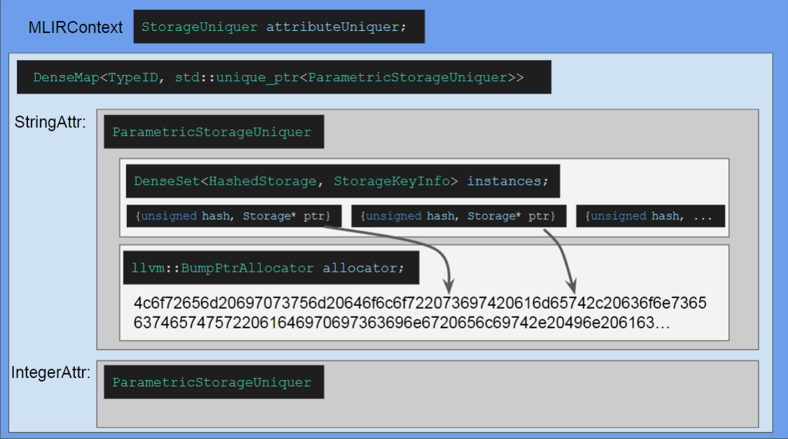
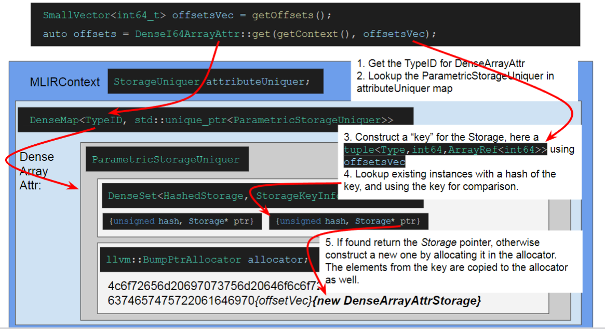

### 参考资料

- MLIR 官方 Docs 中对 Op Properties 的介绍：https://github.com/llvm/llvm-project/blob/main/mlir/docs/LangRef.md#properties
- 一次 MLIR 开放会议对 Op Properties 的说明：https://mlir.llvm.org/OpenMeetings/2023-02-09-Properties.pdf
- 引入 Op Properties 的 commit：https://github.com/llvm/llvm-project/commit/5e118f933b6590cecd7f1afb30845a1594bc4a5d


### Op Properties 的作用

op 的 properties 和 attributes 都是属性的意思，properties 代替了之前 MLIR 中的 inherent attributes，是 op 固有的 attributes，其生命周期与所属 op 相同，properties 的存储直接内联在 op 的存储中，能够比较方便的进行操作和访问。


### 为什么要引入 Op Properties

主要参考：https://mlir.llvm.org/OpenMeetings/2023-02-09-Properties.pdf

``` C++
class Operation {
    ...
    DictionaryAttr attrs;
    ...
}
```

Operation 有一个 DictionaryAttr 数据成员用来访问和操作 attributes，在原本的 MLIR 中，其中的 attributes 可以分为 2 种类型：inherent attributes 和 discardable attributes：

- inherent attributes 是 op 固有的 attributes，其语义只与 op 相关联，inherent attributes 没有 dialect 前缀

  > 应该大部分 attribute 都属于 inherent attributes

- discardable attributes 具有 op 外部定义的语义，discardable attributes 有 dialect 前缀，如 `gpu.container_module`

  > discardable attributes 可能主要是一些与环境相关的 attributes？

#### 复杂的 Attribute 操作



如上图所示，MILR 的所有 attribute 的 storage 指针都由 `MLIRContext` 中的 `attributeUniquer` 进行管理，其中每个 Attribute 类型有对应的 `ParametricStorageUniquer` 管理该类型 attribute 的 storage，而 attribute 实例只是对 attibute storage 指针的封装。

- Attribute 的创建

如果需要构建一个指定 storage 的 attribute，其中涉及了 content-based hashing 操作，以及 attribute storage 的拷贝操作，下图是一个示例说明，实际用法更加复杂。



- Op attributes 的修改

如果需要修改 op 的 attributes，相关代码如下：

``` C++
void setAttr(StringAttr name, Attribute value) {
  NamedAttrList attributes(attrs);
  if (attributes.set(name, value) != value)
    attrs = attributes.getDictionary(getContext());
}

DictionaryAttr NamedAttrList::getDictionary(MLIRContext *context) const {
  ...
  if (!dictionarySorted.getPointer())
    dictionarySorted.setPointer(DictionaryAttr::getWithSorted(context, attrs));
  return llvm::cast<DictionaryAttr>(dictionarySorted.getPointer());
}
```

涉及的操作包括：

1. 将 attribute 字典拷贝到一个 attribute 列表

2. 以 in-place 的方式编辑 attribute 列表

3. 用新的 attribute 列表构建 `DictionaryAttr`

   **因为 `DictionaryAttr` 也是一种 Attribute，因此这一步涉及了底层 Attribute 相关的一系列内容哈希、查找、拷贝操作**

综上，Op Attributes 的操作复杂且低效，因此 MLIR 在后续引入了 Op Properties

### Op Properties 实现

目前 MLIR 引入了 Properties 来代替 inherent Attributes，而 discardable Attributes 依然保留为原始的 Attribute 用法。

#### Properties Usage Example 

``` C++
// mlir/unittests/IR/OpPropertiesTest.cpp
struct TestProperties {
  int a = -1;
  float b = -1.;
  std::vector<int64_t> array = {-33};
  /// A shared_ptr to a const object is safe: it is equivalent to a value-based
  /// member. Here the label will be deallocated when the last operation
  /// referring to it is destroyed. However there is no pool-allocation: this is
  /// offloaded to the client.
  std::shared_ptr<const std::string> label;
  MLIR_DEFINE_EXPLICIT_INTERNAL_INLINE_TYPE_ID(TestProperties)
};

...

class OpWithProperties : public Op<OpWithProperties> {
public:
  // Begin boilerplate
  MLIR_DEFINE_EXPLICIT_INTERNAL_INLINE_TYPE_ID(OpWithProperties)
  using Op::Op;
  static ArrayRef<StringRef> getAttributeNames() { return {}; }
  static StringRef getOperationName() {
    return "test_op_properties.op_with_properties";
  }
  // End boilerplate

  // This alias is the only definition needed for enabling "properties" for this
  // operation.
  using Properties = TestProperties;
  static std::optional<mlir::Attribute> getInherentAttr(MLIRContext *context,
                                                        const Properties &prop,
                                                        StringRef name) {
    return std::nullopt;
  }
  static void setInherentAttr(Properties &prop, StringRef name,
                              mlir::Attribute value) {}
  static void populateInherentAttrs(MLIRContext *context,
                                    const Properties &prop,
                                    NamedAttrList &attrs) {}
  static LogicalResult
  verifyInherentAttrs(OperationName opName, NamedAttrList &attrs,
                      function_ref<InFlightDiagnostic()> emitError) {
    return success();
  }
};
```

以 mlir/unittests/IR/OpPropertiesTest.cpp 为例，如同 `TestProperties`，Properties 就是包含一系列数据的的简单结构体，在定义 Op 时需要使用 `using Properties = TestProperties;` 或者直接在 class Op 中定义 `Properties`。

另外还需要定义 Properties 和 Attributes 转换相关的函数等等，这部分代码可以使用代码自动生成实现。

#### Op Properties Storage

``` C++
// mlir/lib/IR/Operation.cpp
Operation *Operation::create(Location location, OperationName name,
                             TypeRange resultTypes, ValueRange operands,
                             DictionaryAttr attributes,
                             OpaqueProperties properties, BlockRange successors,
                             unsigned numRegions) {
  ...
  int opPropertiesAllocSize = llvm::alignTo<8>(name.getOpPropertyByteSize());
  
  ...
  // Create the new Operation.
  Operation *op = ::new (rawMem) Operation(
      location, name, numResults, numSuccessors, numRegions,
      opPropertiesAllocSize, attributes, properties, needsOperandStorage);

  ...
  return op;
}

Operation::Operation(Location location, OperationName name, unsigned numResults,
                     unsigned numSuccessors, unsigned numRegions,
                     int fullPropertiesStorageSize, DictionaryAttr attributes,
                     OpaqueProperties properties, bool hasOperandStorage)
    : location(location), numResults(numResults), numSuccs(numSuccessors),
      numRegions(numRegions), hasOperandStorage(hasOperandStorage),
      propertiesStorageSize((fullPropertiesStorageSize + 7) / 8), name(name) {
  assert(attributes && "unexpected null attribute dictionary");
  assert(fullPropertiesStorageSize <= propertiesCapacity &&
         "Properties size overflow");
  ...
  if (fullPropertiesStorageSize)
    name.initOpProperties(getPropertiesStorage(), properties);
}
```

Op Properties 的 Storage 直接内联在 Operation 中，在构建 Operation 的时候进行申请和初始化

#### Op Properties Access

```C++
// mlir/include/mlir/IR/Operation.h
class Operation {
  ...
  /// Returns the properties storage size.
  int getPropertiesStorageSize() const {
    return ((int)propertiesStorageSize) * 8;
  }
  /// Returns the properties storage.
  OpaqueProperties getPropertiesStorage() {
    if (propertiesStorageSize)
      return {
          reinterpret_cast<void *>(getTrailingObjects<detail::OpProperties>())};
    return {nullptr};
  }
  ...
}

// mlir/include/mlir/IR/OpDefinition.h
template <class Op>
struct PropertiesSelector<Op, std::void_t<typename Op::Properties>> {
  using type = typename Op::Properties;
};

class Op {
  ...
  template <typename T>
  using InferredProperties = typename PropertiesSelector<T>::type;
  template <typename T = ConcreteType>
  InferredProperties<T> &getProperties() {
    if constexpr (!hasProperties())
      return getEmptyProperties();
    return *getOperation()
                ->getPropertiesStorage()
                .template as<InferredProperties<T> *>();
  }
  ...
}
```

对 Op Properties 的访问通过利用 `TrailingObjects` 获取 Op Properties 的指针实现，上层 Op 实现了一个 `getProperties` 来访问 Op Properties

``` C++
// mlir/include/mlir/IR/Operation.h
class Operation {
  ...
  bool hasAttr(StringAttr name) {
    if (getPropertiesStorageSize()) {
      if (std::optional<Attribute> inherentAttr = getInherentAttr(name))
        return (bool)*inherentAttr;
    }
    return attrs.contains(name);
  }
  ...
  void setAttr(StringAttr name, Attribute value) {
    if (getPropertiesStorageSize()) {
      if (getInherentAttr(name)) {
        setInherentAttr(name, value);
        return;
      }
    }
    NamedAttrList attributes(attrs);
    if (attributes.set(name, value) != value)
      attrs = attributes.getDictionary(getContext());
  }
  ...
  Attribute removeAttr(StringAttr name) {
    if (getPropertiesStorageSize()) {
      if (std::optional<Attribute> inherentAttr = getInherentAttr(name)) {
        setInherentAttr(name, {});
        return *inherentAttr;
      }
    }
    NamedAttrList attributes(attrs);
    Attribute removedAttr = attributes.erase(name);
    if (removedAttr)
      attrs = attributes.getDictionary(getContext());
    return removedAttr;
  }
  ...
}

// mlir/lib/IR/MLIRContext.cpp
std::optional<Attribute>
OperationName::UnregisteredOpModel::getInherentAttr(Operation *op,
                                                    StringRef name) {
  auto dict = dyn_cast_or_null<DictionaryAttr>(getPropertiesAsAttr(op));
  if (!dict)
    return std::nullopt;
  if (Attribute attr = dict.get(name))
    return attr;
  return std::nullopt;
}
void OperationName::UnregisteredOpModel::setInherentAttr(Operation *op,
                                                         StringAttr name,
                                                         Attribute value) {
  auto dict = dyn_cast_or_null<DictionaryAttr>(getPropertiesAsAttr(op));
  assert(dict);
  NamedAttrList attrs(dict);
  attrs.set(name, value);
  *op->getPropertiesStorage().as<Attribute *>() =
      attrs.getDictionary(op->getContext());
}
```

在底层 Operation 只有 `hasAttr`, `setAttr`, `removeAttr` 这些接口实现对 OpProperties 的操作，这些接口将 OpProperties 看作 Attributes，也就是 Inherent Attributes，并且与 discardable Attributes 进行了区别，有不同的实现代码。

